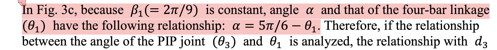
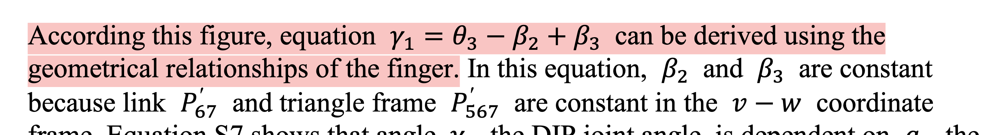
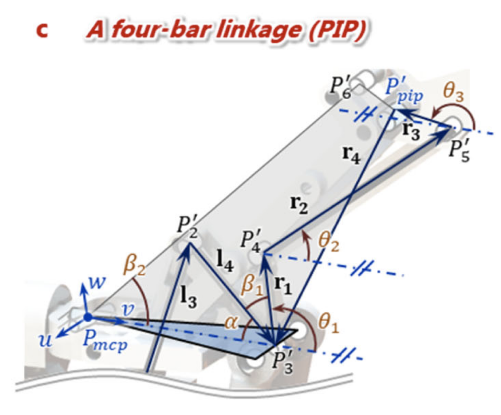
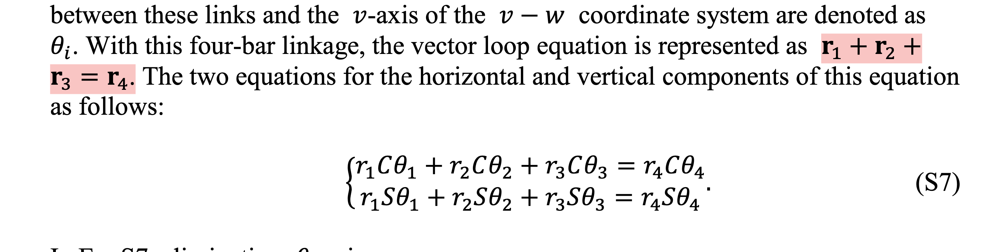

# A Reproduce of ILDA dexterous hand kinematics
## Branch
- 'main': the implementation of the paper with python
- 'simulation': the simulation of the hand with Isaac Sim

Paper Link: [ILDA dexterous hand kinematics](https://www.nature.com/articles/s41467-021-27261-0)

## Core

Based on the core structure of ILDA dexterous hand, and the paper(with its important supplementary materials), I implement the kinematics in python with pytorch.


Some extra features are also implemented:
- Forward kinematics for the dip position in global frame
- Scan to get the reachable workspace

## Some unknown issues
These issues might be caused by my poor math skills or the shallow understanding of the paper.
I just fixed them engineeringly by luck. And I am still searching for the root cause.

### 1


According to the geometrical relationships, 

$\alpha + \theta_1 + \beta_1 = \pi$

so, if $\beta_1 = 2\pi/9$, 

then $\alpha + \theta_1 = \pi - 2\pi/9 = 7\pi/9$

### 2

I don't figure out how the equation is derived. But I do find the equation is wrong.

The correct one shoule be:
$\theta_2 = \theta_3 - \beta_2 + \beta_3 -\pi/2$

### 3


According to the figure, the vector $\vec{r}_4$ has the inverse direction of the others. If referring the figure in main text, the equation should be:

$\vec{r}_1 + \vec{r}_2 + \vec{r}_3 + \vec{r}_4 = 0$

Anthor equation about $\vec{u}$ happens the same problem.

### 4
In the code, the $\theta_1$ is calculated as:
```python
 self.theta1 = math.asin(C2/math.sqrt(A2**2 + B2**2)) - math.atan(B2/A2) + math.pi 
 ```
 in which an extra $\pi$ is added. I did't figure out why, but it works.

